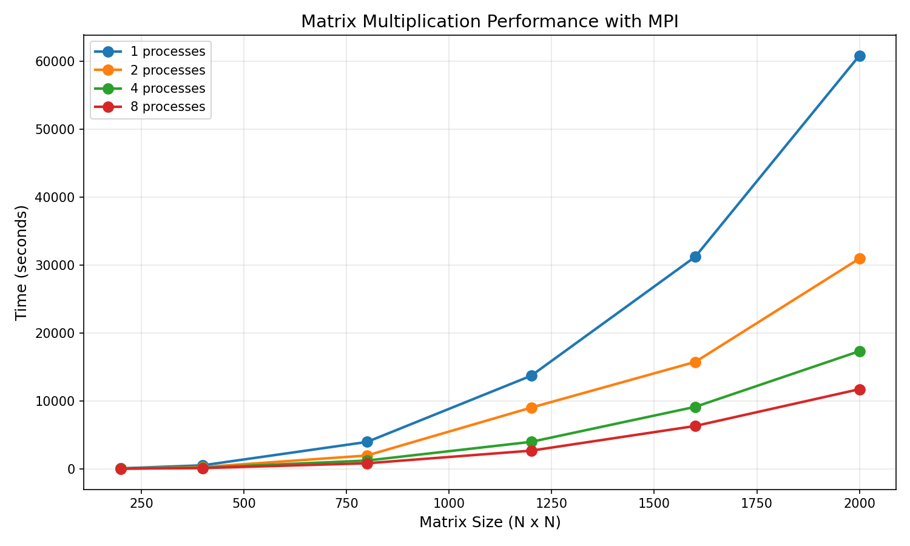

# Ny-Alotha
Parallel_Proggraming
# Лабораторная работа 1
Я написал программу на C++, которая загружает квадратные матрицы из файлов, перемножает их, сохраняет результат. Скрипт `matrix_mul_standart.py` отвечает за создание матриц, работу с директориями, запуск программы на C++, вывод её результатов работы и визуализацию.
# Запуск программы
Ввести `python3 main.py` в терминал.
# Результаты исследования
Запуск программы при исследовании производился с установлением размеров матриц в 200, 400, 600, 800, 1000, 1500, 2000, 2500, 3000 элементов. Результат запусков приведён в таблице ниже:
| Размер матрицы  | Время работы (мс) |
| ------------- | ------------- |
| 200  | 445  |
| 400  | 2288  |
| 600  | 6684  |
| 800  | 16504  |
| 1000  | 31486  |
| 1500  | 109205  |
| 2000  | 298127  |
| 2500  | 488225  |
| 3000  | 835734  |
Визуализация данных таблицы:

# Вывод
Последовательная программа работает неприемлемо долго.