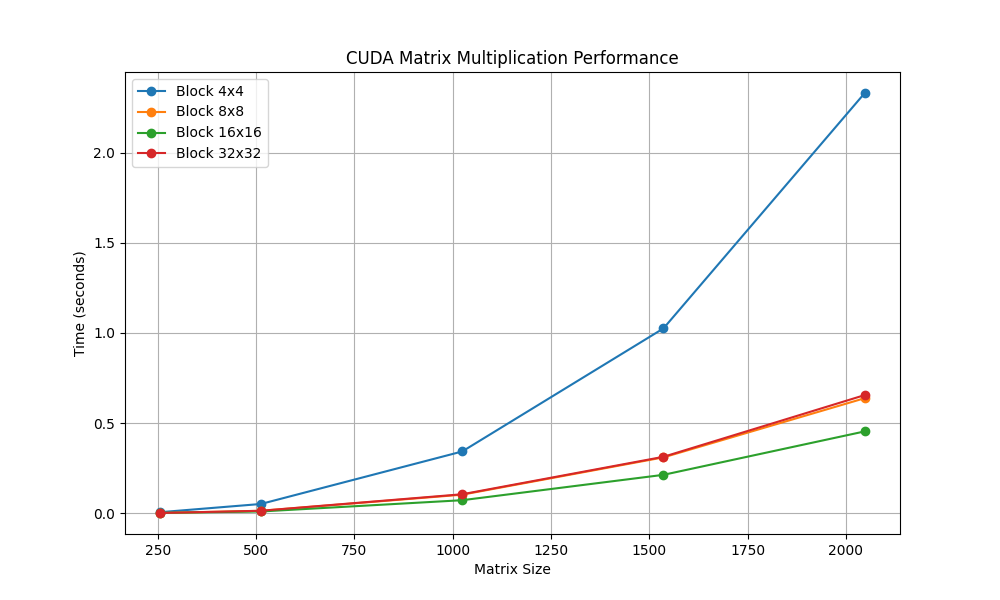

# Ny-Alotha
Parallel_Proggraming
# Лабораторная работа 4
Я изменил программу на C++, которая загружает квадратные матрицы из файлов, перемножает их, сохраняет результат, с использованием технологии NVIDIA CUDA. Основные вычисления перенесены с CPU на графический процессор.
Скрипт `matrix_mul_cuda.py` отвечает за создание матриц, работу с директориями, запуск программы на C++, вывод её результатов работы и визуализацию.
# Запуск программы
Ввести `python3 matrix_mul_cuda.py` в терминал.
# Результаты исследования
Запуск программы при исследовании производился с установлением размеров матриц в 256, 512, 1024, 1536, 2048 элементов в строке и размером блокjd в 4х4, 8х8, 16х16 и 32х32. Результат запусков приведён в таблице ниже:
Время работы (мс)

| Размер матрицы | Block 4×4 | Block 8×8 | Block 16×16 | Block 32×32 |
|----------------|-----------|-----------|-------------|-------------|
| 256×256        | 0,0067    | 0,0022    | 0,0028      | 0,0023      |
| 512×512        | 0,0522    | 0,0143    | 0,0106      | 0,0146      |
| 1024×1024      | 0,3432    | 0,1037    | 0,0731      | 0,1061      |
| 1536×1536      | 1,0255    | 0,3105    | 0,2138      | 0,3137      |
| 2048×2048      | 2,3304    | 0,6387    | 0,4546      | 0,6559      |

Визуализация данных таблицы:

# Вывод
Оптимальный размер блока не является максимально возможным, а зависит от баланса между количеством потоков и ресурсами мультипроцессора.
В данном случае 16x16 (256 потоков) — наиболее эффективная конфигурация.